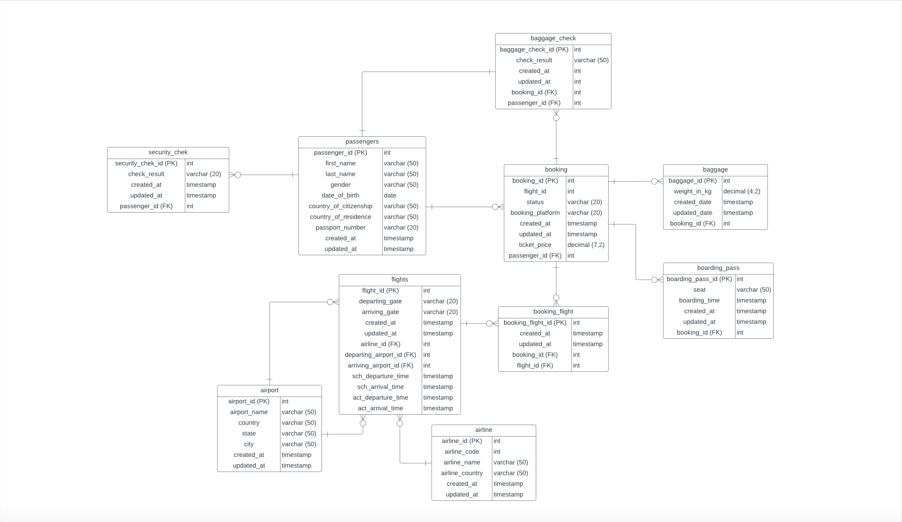

# SkyAnalytics Airways - Data Analytics Project

## Project Overview
SkyAnalytics Airways specializes in airline operations optimization through data analysis.

## Setup Instructions
1. Install PostgreSQL and pgAdmin4
2. Create database: `skyanalytics_airways`
3. Run the SQL scripts in database/ folder
4. Install Python dependencies: `pip install -r requirements.txt`
5. Run analysis: `python src/main.py`

## Tools Used
- PostgreSQL, pgAdmin4
- Python, pandas, psycopg2

## Data Source
The original dataset is located in `database/airport_dump.sql`. This file contains:
- 5 tables: airline, airport, baggage_check, baggage, boarding_pass
- Sample data for airline operations analysis
- Total of 1,070+ records across all tables

## Sample Analytics

### ER Diagram - Database Schema

*Figure 1: Entity Relationship Diagram showing table structures and relationships.*