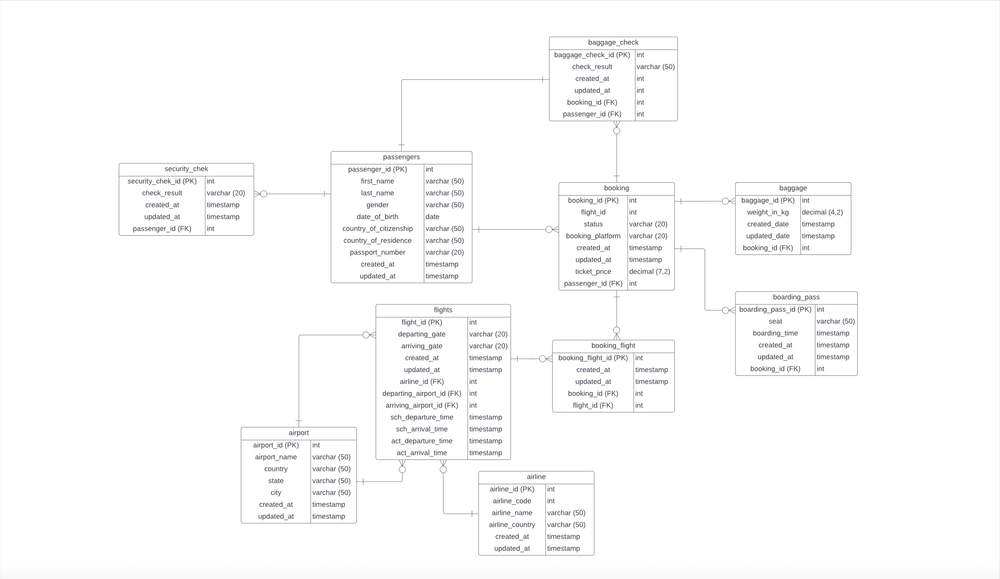

# SkyAnalytics Airways - Data Analytics Project

## Project Overview
SkyAnalytics Airways specializes in airline operations optimization through data analysis.

## Setup Instructions
1. Install PostgreSQL and pgAdmin4
2. Create database: `skyanalytics_airways`
3. Run the SQL scripts in database/ folder
4. Install Python dependencies: `pip install -r requirements.txt`
5. Run analysis: `python src/main.py`

## Tools Used
- PostgreSQL, pgAdmin4
- Python, pandas, psycopg2

## Data Source
The original dataset is located in `database/airport_dump.sql`. This file contains:
- 5 tables: airline, airport, baggage_check, baggage, boarding_pass
- Sample data for airline operations analysis
- Total of 1,070+ records across all tables

## Sample Analytics

### ER Diagram - Database Schema

*Figure 1: Entity Relationship Diagram showing table structures and relationships.*

## Dashboards Created

### 1. Weather Monitoring Dashboard 
- **Description**: Real-time weather data for Almaty from OpenWeatherMap API
- **Metrics**: Temperature, Humidity, Pressure, Wind Speed, Cloudiness, Visibility
- **Features**: 10+ panels, global filter, temperature alert (>35°C)
- **File**: `weather_dashboard.json`

### 2. System Monitoring Dashboard
- **Description**: Real-time system resource monitoring
- **Metrics**: CPU usage, Memory usage, Disk usage, Network traffic, Load average
- **Features**: 10+ panels, global filter, CPU alert (>80%)
- **File**: `system_dashboard.json`

### 3. Database Monitoring Dashboard
- **Description**: PostgreSQL database performance monitoring
- **Metrics**: Active connections, Database size, Transaction rates, Cache hit ratio
- **Features**: 10+ panels, global filter, connections alert (>10)
- **File**: `database_dashboard.json`

## Setup Instructions

### Prerequisites
- Docker and Docker Compose
- OpenWeatherMap API key (for custom exporter)

### Quick Start
1. Clone the repository:
   ```bash
   git clone <your-repo-url>
   cd assignment4